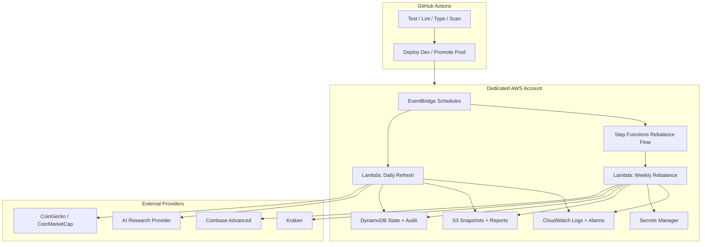

# Crypto Robo Workspace

This workspace bootstraps the crypto robo MVP as three repo-ready components:

- `crypto-robo-runtime`: Python application code for data ingestion, signal generation, risk management, rebalancing, execution, and audit logging.
- `crypto-robo-infra`: Terraform for AWS bootstrap, runtime platform resources, GitHub OIDC, schedules, alarms, and deployment wiring.
- `crypto-robo-research`: Backtests, provider evaluations, prompt assets, and strategy experiments kept separate from runtime code.

The current local workspace uses a single Git repository because that is what was available to implement against. Each top-level component is structured so it can be moved into its own remote repository with minimal reshaping.

## Target Platform

- AWS account model: one dedicated account with `dev` and `prod` stacks
- Runtime: Lambda, EventBridge, Step Functions, DynamoDB, S3, Secrets Manager, CloudWatch
- CI/CD: GitHub Actions with GitHub OIDC into AWS
- Branching: `develop` is the active integration branch, `master` is reserved for release-oriented promotion later

## Workspace Layout

```text
.
|-- .github/
|   `-- workflows/
|-- crypto-robo-runtime/
|-- crypto-robo-infra/
`-- crypto-robo-research/
```

## Architecture



## Getting Started

1. Review each component README for its local workflow.
2. Create separate GitHub repositories from each top-level directory when you are ready to split the codebase.
3. Configure GitHub environments named `dev` and `prod`.
4. Bootstrap AWS with the Terraform under `crypto-robo-infra`.
5. Push the runtime and infra repos to GitHub and enable the included workflows.
